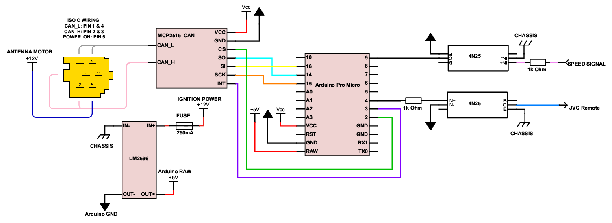

# Clio2JVC

## Description
This is a program for Arduino-based controller, which purpose is to enable stalk remote in Renault Clio equipped with JVC radio device.

## Table of contents
* [Background](#background)
* [Assumptions](#assumptions)
* [Components](#components)
* [Wiring](#wiring)
* [Credits](#credits)

## Background

Some time ago I put a JVC KD-X342BT into Renault Clio II, originally equipped with Update List radio device. This car is equipped with a stalk remote control, placed next to ignition switch. Also, mentioned JVC radio has a single, blue-yellow cable at its back, labeled as "steering wheel remote". Since installation I wanted to connect it all together and use the stalk remote, but in some way I needed to translate remote keypad matrix into digital signal for the radio. I started to search... and I found. See [Credits](#credits) for more details.

## Assupmtions

1. Use existing connectors as much as possible.

  I didn't want to disassemble half of the car to plug some wires. Existing connectors allowed original radio to communicate with remote, so there must be some kind of connection. It turned out, that this communication takes place over CAN bus.

2. All buttons must work as they did with original radio.

  This is a bit tricky, as I never had original device in the car. I just used ideas found in one of projects I mentioned in [Credits](#credits) section.

3. Automatically increase and decrease volume basing on current car speed.

  I drive on highways quite often. Unfortunately, noise level increases greatly when I reach speeds above 100 km/h. In such cases I need to turn volume up and then turn it down as I decelerate. It is a bit burdensome to do it manually, and original radio had this feature built-in.

## Components

* Renault Clio II equipped with:
  - Stalk remote control (part no. 820058695),
  - AFFA2 display (part np. 8200380298 - probably, based on data found in web),
  - JVC KD-X342BT (presumably will work will all other JVC radios which use single wire interface for remote control),
* Arduino board, Pro Micro in my case,
* MCP2515 CAN bus interface for Arduino,
* LM2596 DC-DC step down power converter,
* Two 4N25 optocouplers,
* Two 1k Ohm resistors,
* 250mA fuse,
* ISO 10487 C1 socket,
* 4-way car connector for power and speed signal wires,
* 1-way car connector for remote wire,
* Prototyping board,
* Some wires

## Wiring

## Credits

Thanks to everyone who contributed on following projects:
* [JVC to Clio](https://hackaday.io/project/28150-jvc-to-clio)
* [Smart car radio](https://hackaday.io/project/27439-smart-car-radio)
* [Update list radio protocol](https://megane.com.pl/topic/47797-wy%C5%9Bwietlacz-radia-update-list-protok%C3%B3%C5%82/)
* [JVC stalk adapter DIY](https://www.avforums.com/threads/jvc-stalk-adapter-diy.248455)